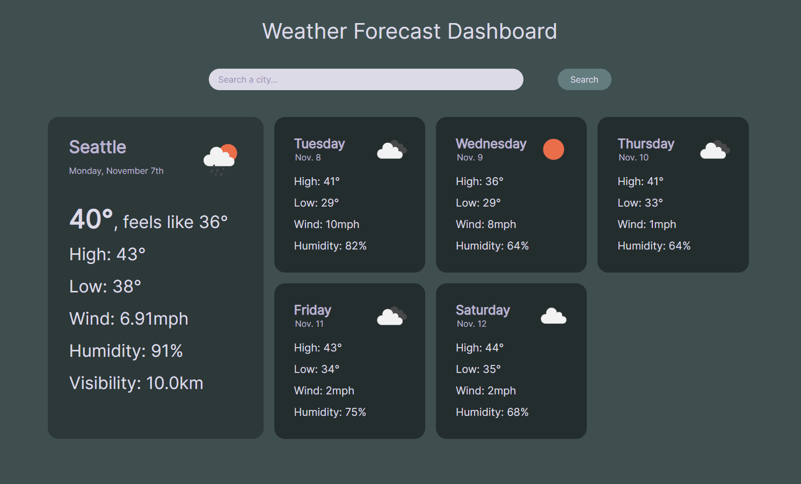

# work-day-scheduler

## Table of Contents

-   [Description](#description)
-   [Photos](#photos)
-   [License](#license)
-   [Deployed Page](#deployed-page)
-   [Contact](#contact)

## Description

As a University of Washington Coding Boot Camp student, I want my understanding of front-end development with JavaScript, HTML, and CSS to improve. I built this project to learn more about third party API usage and JavaScript Promises, as well as improve my styling ability with CSS. This simple weather app provides the user with today's weather as well as a 5-day forecast for any city within Open Weather Map's 200,000+ city database. It handles error statuses and gives the user visual feedback. I think the rejection handling makes this project stand out; the feedback isn't distracting and gets the point across in an aesthetically pleasing way.

## Photos

## Credits

[Open Weather Map API](https://openweathermap.org/api)

[Inter (Google Fonts)](https://fonts.google.com/specimen/Inter)

## License

Please refer to the LICENSE in the repo.

## Deployed Page

<a href="https://vlad-kronk.github.io/weather-dashboard/">Live Site</a>

## Contact

<a href="https://www.linkedin.com/in/jmeyers6/" >LinkedIn</a>

<a href="https://github.com/vlad-kronk">Github</a>
